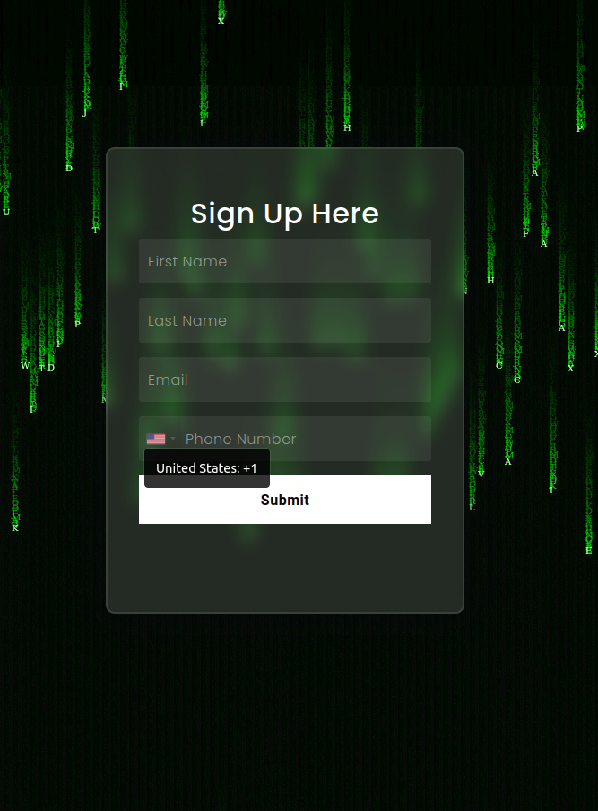

# Crypto Landing Page

Welcome to the Crypto King landing page! This web page showcases our cryptocurrency-related services and information. Below, you'll find details about the page structure and design.

## Table of Contents

- [Introduction](#introduction)
- [Screenshots](#screenshots)
- [How to Use](#how-to-use)
- [Technologies Used](#technologies-used)
- [Contributing](#contributing)
- [License](#license)

## Introduction

This landing page is designed to provide users with information about our cryptocurrency-related services. It features a modern and visually appealing design to engage visitors and encourage them to explore further. The page includes sections for navigation, login, signup, and social media integration.

## Screenshots

Here are three screenshots of our Crypto King landing page to give you a visual overview:

### Screenshot 1


Description: This screenshot showcases the header section of the landing page, including the logo and navigation menu.

### Screenshot 2


Description: This screenshot displays the Sign Up form, allowing users to Sign Up.

### Screenshot 3


Description: This screenshot highlights the "About Us" section, providing information about our services and expertise.

## How to Use

To use this landing page, follow these steps:

1. Clone the repository to your local machine.

```bash
git clone [https://github.com/george313/CryptoLanding.git](https://github.com/GiorgosIlia/CryptoLanding.git)
```

2. Open the `index.html` file in your web browser to view the landing page.

3. Explore the various sections, such as Home, About, How, Login, and Sign Up.

4. Use the social media buttons for quick login options.

5. Contact us using the provided contact information.

## Technologies Used

This landing page is built using the following technologies:

- HTML
- CSS
- Bootstrap
- JavaScript
- jQuery
- Owl Carousel (for image sliders)
- Font Awesome (for icons)

## Contributing

Contributions are welcome! If you'd like to contribute to the development of this landing page, please follow these guidelines:

1. Fork the repository.

2. Create a new branch for your feature or bug fix.

3. Make your changes and ensure that the code is well-documented.

4. Test your changes thoroughly.

5. Submit a pull request with a clear description of your changes.

## License

This project is licensed under the [MIT License](LICENSE).
